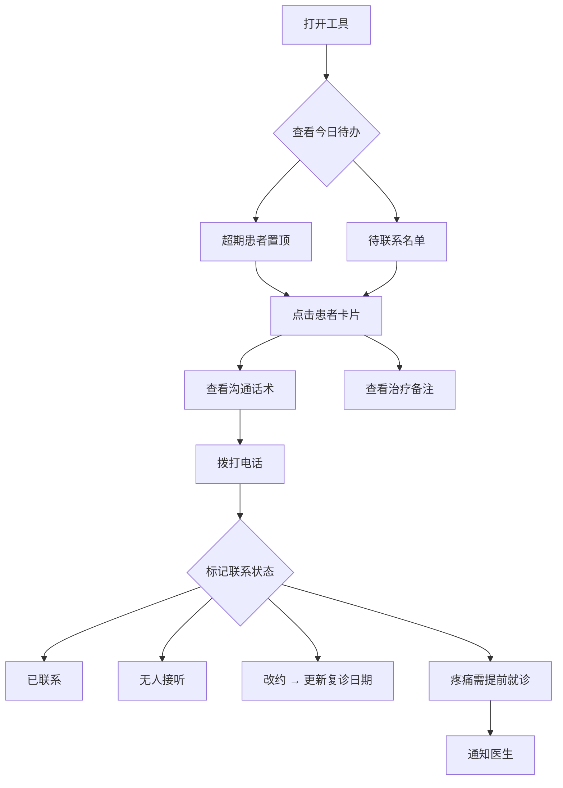
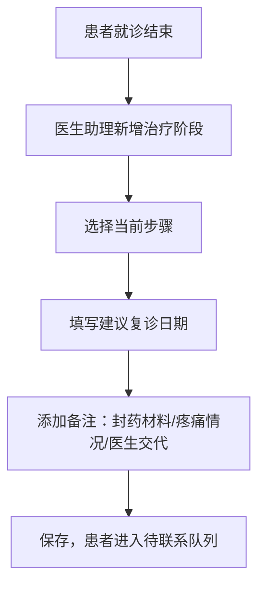

## 1. 产品概述

根管治疗复诊跟进工具——面向小门诊前台和医生助理的轻量级命令式工具，专注解决根管治疗多次就诊间的衔接问题，减少患者中途流失。使用者输入患者姓名、手机号、牙位和当前步骤，即可生成当天待联系名单，快速标记联系状态，管理复诊进度。

- 核心问题：根管治疗通常需要3-4次复诊，小门诊缺乏简单工具追踪患者回访，导致患者流失率高
- 目标用户：诊所前台（日常联系患者）、医生助理（记录治疗详情和医嘱）
- 目标价值：将复诊流失率降低30%以上，每天5分钟完成当日联系任务

## 2. 核心功能

### 2.1 用户角色

| 角色 | 使用场景 | 核心权限 |
|------|----------|----------|
| 前台 | 每日查看待联系名单、拨打电话、标记联系状态 | 查看病例、标记联系状态、新增患者 |
| 医生助理 | 记录封药材料、疼痛情况、医生特别交代 | 查看病例、编辑备注、新增治疗阶段 |

### 2.2 功能模块

1. **今日待办页面**：超期患者优先展示、待联系名单、联系状态标记、沟通话术一键生成
2. **病例管理页面**：快速新增患者、治疗阶段管理、备注编辑、按状态筛选
3. **数据总览页面**：治疗阶段分布、超期统计、近期完成情况

### 2.3 页面详情

| 页面名称 | 模块名称 | 功能描述 |
|----------|----------|----------|
| 今日待办 | 超期预警区 | 超过建议复诊日期的患者红色高亮置顶展示，显示超期天数 |
| 今日待办 | 待联系名单 | 按建议复诊日期排序，显示姓名、牙位、当前步骤、建议复诊日期 |
| 今日待办 | 联系状态标记 | 快速标记：已联系、无人接听、改约、疼痛需提前就诊 |
| 今日待办 | 沟通话术 | 根据治疗步骤自动生成电话沟通话术，一键复制 |
| 病例管理 | 快速新增 | 输入姓名、手机号、牙位、当前步骤即可创建病例 |
| 病例管理 | 治疗阶段 | 为已有病例添加新的治疗阶段记录，含日期、步骤、建议复诊时间 |
| 病例管理 | 备注编辑 | 记录封药材料、上次疼痛情况、医生特别交代 |
| 病例管理 | 筛选查看 | 按步骤、联系状态、超期状态筛选病例 |
| 数据总览 | 阶段分布 | 各治疗步骤的病例数量饼图 |
| 数据总览 | 超期统计 | 当前超期未联系患者数量、平均超期天数 |
| 数据总览 | 完成趋势 | 近期完成根管治疗的病例数 |

## 3. 核心流程

**前台每日工作流：**
1. 早上打开工具，首页自动展示今日待联系名单
2. 超期患者红色标注置顶，优先联系
3. 点击患者卡片展开详情和沟通话术
4. 拨打电话后标记联系状态
5. 若改约则更新下次复诊日期

**医生助理记录流：**
1. 患者就诊后，在病例中新增治疗阶段
2. 填写当前步骤（已封药待复诊/已预备待充填/已完成充填等）
3. 在备注中记录封药材料、疼痛情况、医生特别交代
4. 设定建议复诊日期

## 4. 用户界面设计

### 4.1 设计风格

- **主色调**：温暖的深青色 (#0D7377)——医疗信任感与温暖感兼具
- **辅助色**：柔橘色 (#E8873A)——用于警示和强调，如超期标记
- **危险色**：珊瑚红 (#E05252)——用于严重超期和疼痛标记
- **成功色**：鼠尾草绿 (#6B9E78)——用于已完成状态
- **背景色**：暖灰白 (#FAF8F5)——避免纯白的冰冷感
- **卡片色**：纯白 (#FFFFFF) 带柔和阴影
- **按钮风格**：圆角（8px）、实心填充、hover微抬升
- **字体**：Noto Sans SC（中文）+ DM Sans（数字/英文），清晰易读
- **布局风格**：左侧窄导航栏 + 右侧内容区，卡片式信息展示
- **图标风格**：Lucide线性图标，简洁统一

### 4.2 页面设计概览

| 页面名称 | 模块名称 | UI元素 |
|----------|----------|--------|
| 今日待办 | 超期预警区 | 红色左边框卡片、超期天数徽标、呼吸动画警示 |
| 今日待办 | 待联系名单 | 卡片列表、状态标签（彩色圆角徽标）、点击展开详情 |
| 今日待办 | 沟通话术 | 底部滑出面板、话术文字、一键复制按钮 |
| 病例管理 | 快速新增 | 右侧抽屉式表单、牙位选择器、步骤下拉 |
| 病例管理 | 病例列表 | 表格式/卡片式切换、筛选栏、搜索框 |
| 病例管理 | 治疗时间线 | 纵向时间线组件、每个节点显示步骤和日期 |
| 数据总览 | 统计卡片 | 大数字展示、趋势箭头、环比变化 |

### 4.3 响应式设计

- 桌面优先设计（诊所主要使用台式电脑）
- 最小支持1024px宽度
- 卡片列表在窄屏下自动单列排列

### 4.4 沟通话术模板

| 治疗步骤 | 话术模板 |
|----------|----------|
| 已封药待复诊 | "您好，XX先生/女士，我是XX口腔诊所。您X天前在我们这里做了根管封药治疗，医生建议您在X月X日前来复诊，请问您方便什么时候过来？" |
| 已预备待充填 | "您好，XX先生/女士，我是XX口腔诊所。您的根管已经完成预备，现在需要安排充填，建议尽快来诊完成治疗，以免感染。" |
| 已充填待冠修复 | "您好，XX先生/女士，我是XX口腔诊所。您的根管充填已完成，建议尽快安排牙冠修复以保护患牙。" |
| 疼痛需提前就诊 | "您好，XX先生/女士，我们了解到您目前有疼痛情况，建议您尽快来诊，医生会为您检查处理。" |
