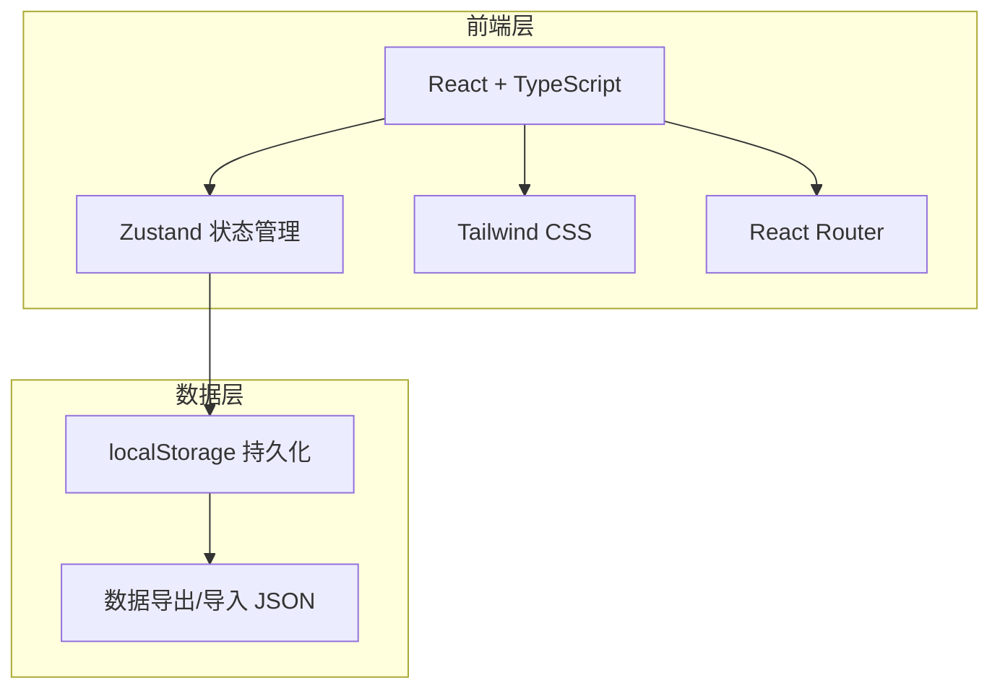
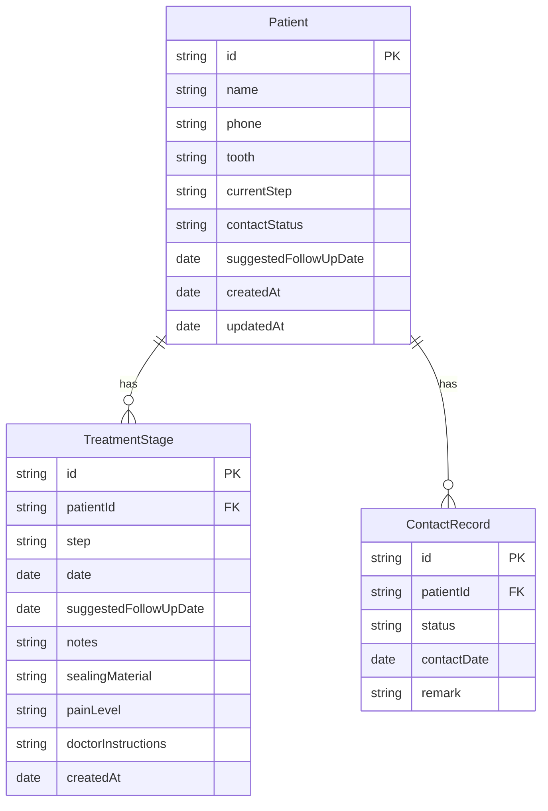

## 1. 架构设计



纯前端架构，使用 localStorage 进行数据持久化，配合 JSON 导出/导入功能确保数据安全。适合不想部署服务端的小门诊场景。

## 2. 技术说明

- **前端**：React@18 + TypeScript + Tailwind CSS@3 + Vite
- **初始化工具**：vite-init
- **状态管理**：Zustand（轻量、简洁）
- **路由**：react-router-dom@6
- **图标**：lucide-react
- **后端**：无（纯前端，localStorage 持久化）
- **数据库**：无（localStorage + JSON 导出/导入）

## 3. 路由定义

| 路由 | 用途 |
|------|------|
| `/` | 今日待办页面 - 默认首页，展示待联系名单和超期预警 |
| `/cases` | 病例管理页面 - 病例列表、新增、编辑 |
| `/cases/:id` | 病例详情页面 - 治疗时间线、备注编辑 |
| `/stats` | 数据总览页面 - 统计图表和概览 |

## 4. 数据模型

### 4.1 数据模型定义



### 4.2 数据类型定义

```typescript
type TreatmentStep =
  | "开髓引流"
  | "已封药待复诊"
  | "已预备待充填"
  | "已充填待冠修复"
  | "已完成"

type ContactStatus =
  | "待联系"
  | "已联系"
  | "无人接听"
  | "改约"
  | "疼痛需提前就诊"

type PainLevel = "无痛" | "轻微" | "中度" | "剧烈"

interface Patient {
  id: string
  name: string
  phone: string
  tooth: string
  currentStep: TreatmentStep
  contactStatus: ContactStatus
  suggestedFollowUpDate: string
  createdAt: string
  updatedAt: string
}

interface TreatmentStage {
  id: string
  patientId: string
  step: TreatmentStep
  date: string
  suggestedFollowUpDate: string
  notes: string
  sealingMaterial: string
  painLevel: PainLevel
  doctorInstructions: string
  createdAt: string
}

interface ContactRecord {
  id: string
  patientId: string
  status: ContactStatus
  contactDate: string
  remark: string
}
```

### 4.3 牙位选择

使用国际牙科联合会(FDI)牙位编号系统，支持快速选择：
- 上颌右侧：11-18
- 上颌左侧：21-28
- 下颌左侧：31-38
- 下颌右侧：41-48

## 5. 状态管理设计

使用 Zustand 创建全局 store，包含以下 slice：

```typescript
interface RootCanalStore {
  patients: Patient[]
  treatmentStages: TreatmentStage[]
  contactRecords: ContactRecord[]

  addPatient: (patient: Omit<Patient, 'id' | 'createdAt' | 'updatedAt'>) => void
  updatePatient: (id: string, updates: Partial<Patient>) => void
  deletePatient: (id: string) => void

  addTreatmentStage: (stage: Omit<TreatmentStage, 'id' | 'createdAt'>) => void

  addContactRecord: (record: Omit<ContactRecord, 'id'>) => void

  getOverduePatients: () => Patient[]
  getTodayContactList: () => Patient[]
  getPatientsByStep: (step: TreatmentStep) => Patient[]

  exportData: () => string
  importData: (json: string) => void
}
```

## 6. 组件结构

```
src/
├── components/
│   ├── layout/
│   │   ├── Sidebar.tsx          # 左侧导航栏
│   │   └── AppLayout.tsx        # 整体布局
│   ├── patient/
│   │   ├── PatientCard.tsx      # 患者卡片
│   │   ├── PatientForm.tsx      # 新增/编辑患者表单
│   │   ├── ContactStatusBadge.tsx # 联系状态标签
│   │   └── ToothSelector.tsx    # 牙位选择器
│   ├── treatment/
│   │   ├── TreatmentTimeline.tsx # 治疗时间线
│   │   ├── StageForm.tsx        # 新增治疗阶段表单
│   │   └── NotesEditor.tsx      # 备注编辑器
│   ├── contact/
│   │   ├── ContactScript.tsx    # 沟通话术面板
│   │   └── ContactAction.tsx    # 联系操作按钮组
│   └── stats/
│       ├── StatCard.tsx         # 统计卡片
│       └── StepDistribution.tsx # 步骤分布图
├── pages/
│   ├── TodayPage.tsx            # 今日待办
│   ├── CasesPage.tsx            # 病例管理
│   ├── CaseDetailPage.tsx       # 病例详情
│   └── StatsPage.tsx            # 数据总览
├── store/
│   └── useStore.ts              # Zustand store
├── utils/
│   ├── scripts.ts               # 沟通话术生成
│   ├── tooth.ts                 # 牙位工具函数
│   └── date.ts                  # 日期工具函数
├── App.tsx
└── main.tsx
```
